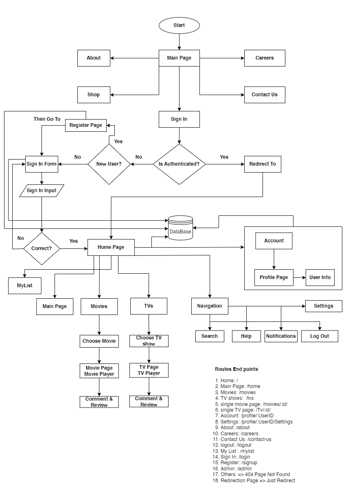

# Movlex Movies Watching Application

This application consists of two divisions: Client and Server. The Client division is a React application, and the Server division handles the backend functionality.

## Getting Started

To run the Client application, navigate to the Client directory and execute the following command:

`npm run start`

To run the Server application in development mode, navigate to the Server directory and execute the following command:

`npm start`

## Diagram Description

The following diagram provides an overview of the application's structure:

The diagram illustrates the flow of the application, starting from the "Start" node and leading to various sections:

- **Main Page**: Represents the main page of the application.
- **About**: Represents the About section of the application.
- **Careers**: Represents the Careers section of the application.
- **Shop**: Represents the Shop section of the application.
- **Contact Us**: Represents the Contact Us section of the application.
- **Sign In**: Represents the Sign In section of the application.
- **Is Authenticated?**: Represents a decision point that checks if the user is authenticated.
- **Redirect To**: Represents the redirection point based on the authentication status.
- **New User?**: Represents a decision point that checks if the user is new.

Please refer to the diagram for a visual representation of the application's flow.

## Contributing

Contributions are welcome! If you find any issues or would like to enhance the application, feel free to submit a pull request.

## License

This application is open source and is released under the [MIT License](LICENSE).
